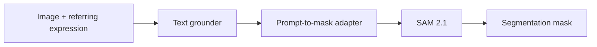
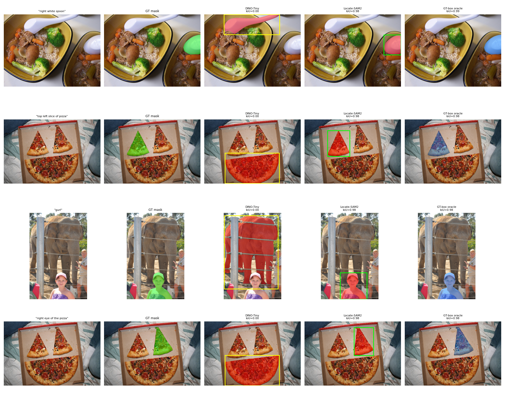
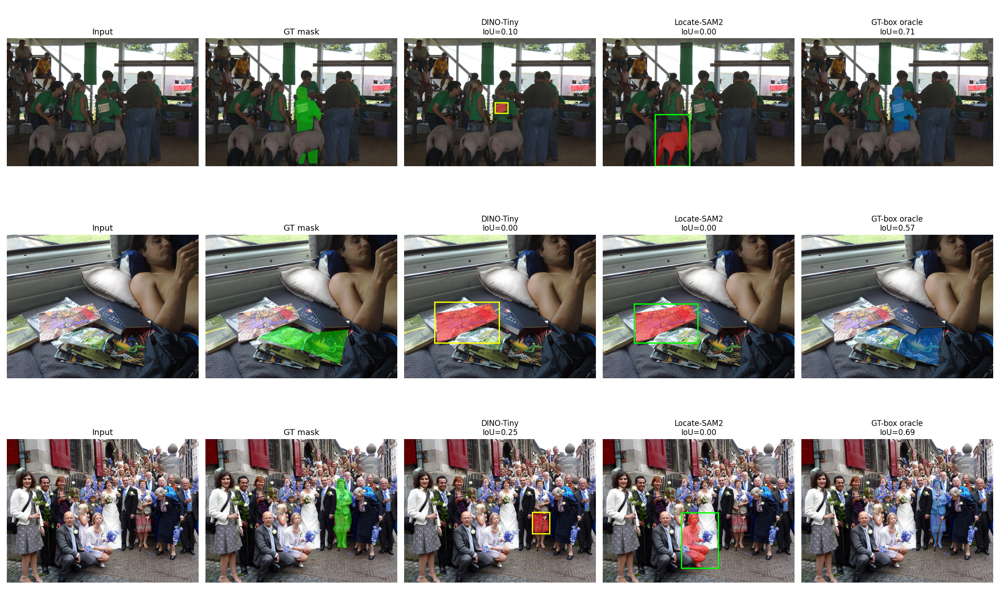
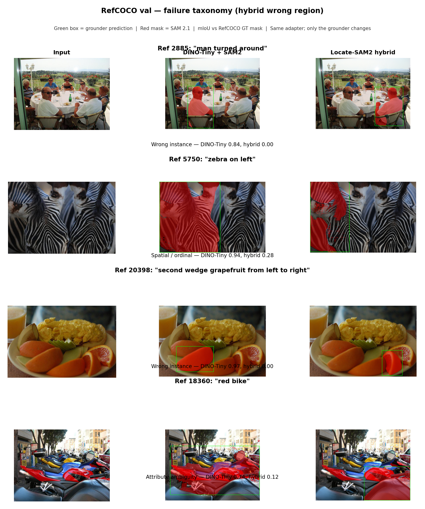

# Locate-SAM2

Training-free referring expression segmentation with [LocateAnything-3B](https://huggingface.co/nvidia/LocateAnything-3B) as the language grounder and [SAM 2.1](https://huggingface.co/facebook/sam2.1-hiera-large) as the segmenter. The system follows the modular layout used in Grounded-SAM work: text to box to mask, with a small prompt-to-mask adapter between grounding and SAM.

Paper source and figures: [`research_paper/`](research_paper/). Published metric summaries: [`benchmarks/`](benchmarks/).

## Overview

Given an image and a referring expression, LocateAnything predicts one or more boxes. The adapter converts each box into SAM prompts (box, box plus point, or point), optionally crops around the box, and selects a mask when SAM returns multiple candidates. The primary baseline is Grounding DINO (Swin-T) plus SAM 2.1 under the same adapter; Grounding DINO-Tiny is included as a lightweight reference.

Evaluation uses RefCOCO, RefCOCO+, and RefCOCO-g validation splits, plus RefCOCO and RefCOCO+ testA and testB. Metrics are mean mask IoU and precision at IoU 0.5, with a GT-box plus SAM oracle for diagnostic comparison.

Evaluation uses RefCOCO, RefCOCO+, and RefCOCO-g validation splits, plus RefCOCO and RefCOCO+ testA and testB. Metrics are mean mask IoU and precision at IoU 0.5, with a GT-box plus SAM oracle for diagnostic comparison.

### Pipeline



Grounders compared under the **same** adapter and SAM 2.1 weights:

| Method | Grounder | Role |
|--------|----------|------|
| DINO-Tiny + SAM2 | Grounding DINO-Tiny | Lightweight visual baseline |
| DINO-Base + SAM2 | Grounding DINO Swin-T | **Primary baseline** (result tables) |
| Locate-SAM2 (fast) | LocateAnything-3B | Single-pass generation |
| Locate-SAM2 (hybrid) | LocateAnything-3B | Hybrid generation (best) |
| GT-box + SAM2 | Ground-truth box | Oracle upper bound |

### Qualitative results

Visual examples from **RefCOCO val** (full val = 3,811 referring expressions). Figures use the standard RES layout: input, ground-truth mask, baseline prediction, our prediction, and oracle.

**How to read each column**

| Column | Meaning |
|--------|---------|
| **Input** | COCO image; title = referring expression |
| **GT mask** | RefCOCO ground-truth segmentation (green) |
| **DINO-Tiny** | Grounding DINO-Tiny box (yellow) + SAM 2.1 mask (red); IoU in title |
| **Locate-SAM2** | LocateAnything hybrid box (green) + SAM 2.1 mask (red); IoU in title |
| **GT-box oracle** | SAM 2.1 given the GT box (blue); shows adapter ceiling |

**Figure 1 — Hybrid wins** (DINO-Tiny misses or wrong box; hybrid correct):

<p align="center">
  
</p>

**Figure 2 — Hard cases** (both grounders struggle; oracle still reasonable):

<p align="center">
  
</p>

**Figure 3 — Failure taxonomy** (cases where hybrid picks the wrong object; DINO-Tiny often correct):

<p align="center">
  
</p>

Green box = grounder prediction. Red overlay = SAM 2.1 mask. mIoU = mask overlap vs RefCOCO GT.

More exported panels (12 case folders, hallucination probe): [`research_paper/figures/`](research_paper/figures/). All methods and splits: [`benchmarks/`](benchmarks/) and Results below.

## Installation

Requires Python 3.10+, CUDA, and roughly 10 GB for model weights.

```bash
git clone https://github.com/jrootn/locate-sam2.git
cd locate-sam2
python -m venv .venv && source .venv/bin/activate
pip install -e .
pip install torch torchvision --index-url https://download.pytorch.org/whl/cu128

bash scripts/download_models.sh      # LocateAnything-3B + SAM 2.1
bash scripts/download_baseline.sh    # Grounding DINO-Tiny (optional)
bash scripts/download_data.sh        # RefCOCO annotations + val images (~8 GB)
bash scripts/download_train2014.sh # train2014 images for RefCOCO eval (~13 GB)
```

Inference:

```python
from locate_sam2 import segment

masks = segment("image.jpg", "red car on the left")
```

```bash
locate-sam2 segment image.jpg "person holding umbrella" -o out.png
```

Adapter defaults live in `configs/default.yaml` (`prompt_mode`, `crop_mode`, `rerank`, `generation_mode`).

## Reproducing benchmarks

Full validation (all methods, zero subset size):

```bash
bash scripts/run_full_eval_suite.sh          # RefCOCO val
bash scripts/run_missing_experiments.sh      # RefCOCO+, RefCOCO-g
bash scripts/run_test_splits.sh              # RefCOCO / RefCOCO+ testA, testB
```

Subset runs for development:

```bash
python scripts/run_benchmark.py --subset-size 200 --seed 42
python scripts/run_ablation.py --subset-size 200
python scripts/validate_eval.py --subset-size 200 --seed 42
```

Outputs are written under `outputs/` locally. Summary JSON files checked into the repository are under `benchmarks/`.

## Results

Numbers below are taken from `benchmarks/`. Latency was measured on one NVIDIA RTX PRO 6000 (Blackwell); peak VRAM is often more informative across hardware.

### RefCOCO val (n = 3,811)

| Method | mIoU | P@0.5 | Peak VRAM (GB) |
|--------|-----:|------:|---------------:|
| Grounding DINO-Tiny + SAM2 | 0.441 | 48.6% | 2.9 |
| Grounding DINO-Base + SAM2 | 0.717 | 81.7% | 3.1 |
| Locate-SAM2 (fast) | 0.769 | 87.5% | 8.9 |
| Locate-SAM2 (hybrid) | **0.772** | **88.1%** | 8.9 |
| GT-box + SAM2 (oracle) | 0.836 | 95.2% | 1.3 |

Hybrid exceeds DINO-Base by 5.5 mIoU on this split and reaches 92.3% of the oracle mIoU.

### RefCOCO+ val (n = 3,805)

| Method | mIoU | P@0.5 |
|--------|-----:|------:|
| Grounding DINO-Base + SAM2 | 0.612 | 69.4% |
| Locate-SAM2 (hybrid) | **0.717** | **81.6%** |
| GT-box + SAM2 (oracle) | 0.836 | 95.2% |

### RefCOCO-g val (n = 5,000, Google split)

| Method | mIoU | P@0.5 |
|--------|-----:|------:|
| Grounding DINO-Base + SAM2 | 0.666 | 75.4% |
| Locate-SAM2 (hybrid) | **0.746** | **85.0%** |
| GT-box + SAM2 (oracle) | 0.815 | 93.1% |

### RefCOCO / RefCOCO+ test splits (hybrid vs DINO-Base)

| Dataset | Split | Hybrid mIoU | DINO-Base mIoU |
|---------|-------|------------:|---------------:|
| RefCOCO | testA | 0.807 | 0.761 |
| RefCOCO | testB | 0.730 | 0.661 |
| RefCOCO+ | testA | 0.766 | 0.708 |
| RefCOCO+ | testB | 0.650 | 0.517 |

Full tables: `benchmarks/refcoco_val_table.json`, `benchmarks/refcoco_plus_table.json`, `benchmarks/refcocog_table.json`, `benchmarks/test_splits/`.

This repository reports modular zero-shot pipeline comparisons. It does not compare against supervised RES methods (e.g. LAVT, CRIS) that train on mask annotations.

## Repository layout

```text
locate_sam2/          Python package (grounder, adapter, SAM2, eval)
scripts/              Download helpers and eval drivers
configs/              Default pipeline settings
benchmarks/           Published summary metrics (no per-image logs)
research_paper/       LaTeX manuscript and qualitative figures
experiments/          Notes and OOD protocol templates
```

Not versioned: `models/`, `data/`, `outputs/`, virtual environments. Per-reference eval logs remain local after a full run.

## License

| Component | License |
|-----------|---------|
| This repository | MIT |
| LocateAnything-3B | [NVIDIA license](https://huggingface.co/nvidia/LocateAnything-3B) (non-commercial; academic use permitted) |
| SAM 2.1 | Apache 2.0 |
| Grounding DINO | Apache 2.0 |

## References

- Ren et al., Grounded SAM, arXiv:2401.14159
- Wang et al., LocateAnything, arXiv:2605.27365
- Ravi et al., SAM 2, 2024
