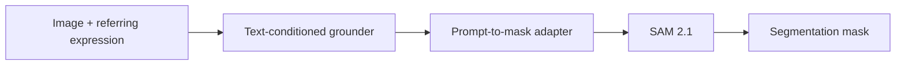

# Locate-SAM2

Training-free referring expression segmentation with [NVIDIA LocateAnything-3B](https://huggingface.co/nvidia/LocateAnything-3B) as the language-conditioned grounder and [SAM 2.1](https://huggingface.co/facebook/sam2.1-hiera-large) as the mask generator.

Locate-SAM2 follows the same modular idea used by Grounded-SAM style systems: text expression -> box -> SAM prompt -> segmentation mask. This repository integrates LocateAnything as the grounder inside a SAM2 pipeline and evaluates it against Grounding DINO under a **shared** prompt-to-mask adapter.

Published metric summaries are in [`benchmarks/`](benchmarks/). The manuscript source is kept outside the public repository; this repo contains the code, configuration, scripts, summary results, and README figures needed to reproduce or validate the reported claims.

## What This Repository Shows

Under the same SAM 2.1 adapter, Locate-SAM2 hybrid improves over Grounding DINO-Base + SAM2 on RefCOCO, RefCOCO+, and RefCOCO-g validation, and on RefCOCO / RefCOCO+ testA and testB.

This is a **modular zero-shot pipeline comparison**, not a supervised RES leaderboard claim.

### In-domain vs out-of-domain evaluation

| Benchmark family | Status | Interpretation |
|------------------|--------|----------------|
| **RefCOCO / RefCOCO+ / RefCOCO-g** | Complete, see [`benchmarks/`](benchmarks/) | **In-domain for LocateAnything.** Its public training mix includes RefCOCO-family referring data. Treat these numbers as a controlled integration study (same adapter, swap grounder), not as proof of general OOD grounding. |
| **Out-of-domain images** | Not included | No scored OOD table is reported in this public release. |

**Quantitative baseline:** DINO-Base + SAM2 (tables). **Qualitative overlays:** DINO-Tiny + SAM2 in [`docs/assets/`](docs/assets/) for visual contrast; DINO-Tiny is not the primary baseline in result tables.

## Method

Given an image and a referring expression, the pipeline:

1. sends the expression and image to a text-conditioned grounder,
2. converts the predicted box into SAM2 prompts,
3. optionally crops around the predicted region,
4. asks SAM 2.1 for masks,
5. selects the final mask from SAM candidates.



Grounders are compared under the same adapter and SAM 2.1 weights.

| Method | Grounder | Role |
|--------|----------|------|
| DINO-Tiny + SAM2 | Grounding DINO-Tiny | Lightweight reference (qualitative overlays) |
| DINO-Base + SAM2 | Grounding DINO Swin-T | **Primary quantitative baseline** |
| Locate-SAM2 fast | LocateAnything-3B | Single-pass LocateAnything decoding |
| Locate-SAM2 hybrid | LocateAnything-3B | Best LocateAnything decoding setting |
| GT-box + SAM2 | Ground-truth box | Diagnostic upper bound |

## Qualitative Examples

Examples are from **RefCOCO validation** (in-domain for LocateAnything). Green box = grounder prediction; red overlay = SAM 2.1 mask; mIoU vs RefCOCO GT mask.

| Column | What it shows |
|--------|---------------|
| Input image | COCO image + referring expression |
| DINO-Tiny + SAM2 | Lightweight baseline (per-case overlays on disk) |
| Locate-SAM2 hybrid | LocateAnything hybrid + same SAM2 adapter |

The public README keeps compact composite figures in [`docs/assets/`](docs/assets/). Per-reference overlays and manuscript assembly files are local artifacts and are not versioned.

<p align="center">
  
</p>

The first panel illustrates cases where the LocateAnything grounder recovers objects missed by DINO-Tiny under the same SAM2 adapter. The second panel shows selected failure modes: wrong-instance selection, spatial or ordinal language, attribute ambiguity, and unusual expressions.

<p align="center">
  
</p>

We also include a small negative-prompt sanity check. This is not a benchmark score. It documents a practical limitation: LocateAnything does not expose the same kind of native detection confidence threshold as DINO, so impossible prompts may still produce a confident-looking box and mask.

<p align="center">
  
</p>

## Installation

Requires Python 3.10+, CUDA, and roughly 10 GB for model weights.

```bash
git clone https://github.com/jrootn/locate-sam2.git
cd locate-sam2
python -m venv .venv
source .venv/bin/activate
pip install -e .
pip install torch torchvision --index-url https://download.pytorch.org/whl/cu128

bash scripts/download_models.sh        # LocateAnything-3B + SAM 2.1
bash scripts/download_baseline.sh      # Grounding DINO-Tiny (optional)
bash scripts/download_data.sh          # RefCOCO annotations + val images
bash scripts/download_train2014.sh     # train2014 images for RefCOCO-family eval
bash scripts/download_dino_swint.sh    # Grounding DINO-Base (primary baseline)
```

Python inference:

```python
from locate_sam2 import segment

masks = segment("image.jpg", "red car on the left")
```

CLI inference:

```bash
locate-sam2 segment image.jpg "person holding umbrella" -o out.png
```

Adapter defaults live in [`configs/default.yaml`](configs/default.yaml).

## Reproducing Benchmarks

**RefCOCO family** (full val / test splits):

```bash
bash scripts/run_full_eval_suite.sh      # RefCOCO val
bash scripts/run_missing_experiments.sh  # RefCOCO+ and RefCOCO-g val
bash scripts/run_test_splits.sh          # RefCOCO and RefCOCO+ testA/testB
```

**Development** (subset runs):

```bash
python scripts/run_benchmark.py --subset-size 200 --seed 42
python scripts/run_ablation.py --subset-size 200
python scripts/validate_eval.py --subset-size 200 --seed 42
```

**Mechanistic analyses** (require local per-reference records under `outputs/`; committed summaries live in `benchmarks/analysis/`):

```bash
python scripts/analyze_box_iou_stratification.py
python scripts/analyze_hybrid_disagreement.py --subset-size 500
python scripts/run_generation_mode_study.py --subset-size 200
python scripts/probe_hybrid_fallback.py --subset-size 200 --seed 42
python scripts/probe_hallucination.py
```

Local outputs: `outputs/`. Published summaries: [`benchmarks/`](benchmarks/). Per-reference logs stay local (gitignored).

## Results

Metrics are mean mask IoU and precision at IoU 0.5. Validation numbers use RefCOCO, RefCOCO+, and RefCOCO-g val. Test numbers use RefCOCO and RefCOCO+ testA/testB. Latency and memory were measured on one NVIDIA RTX PRO 6000 Blackwell GPU.

### Validation Splits

| Dataset | n | DINO-Tiny mIoU | DINO-Base mIoU | Locate-SAM2 hybrid mIoU | GT-box oracle mIoU |
|---------|--:|---------------:|---------------:|------------------------:|-------------------:|
| RefCOCO val | 3,811 | 0.441 | 0.717 | **0.772** | 0.836 |
| RefCOCO+ val | 3,805 | 0.440 | 0.612 | **0.717** | 0.836 |
| RefCOCO-g val | 5,000 | 0.503 | 0.666 | **0.746** | 0.815 |

### Test Splits

| Dataset | Split | n | DINO-Base mIoU | Locate-SAM2 hybrid mIoU | DINO-Base P@0.5 | Locate-SAM2 hybrid P@0.5 |
|---------|-------|--:|---------------:|------------------------:|----------------:|-------------------------:|
| RefCOCO | testA | 1,975 | 0.761 | **0.807** | 87.4% | **93.1%** |
| RefCOCO | testB | 1,810 | 0.661 | **0.730** | 73.5% | **81.5%** |
| RefCOCO+ | testA | 1,975 | 0.708 | **0.766** | 81.3% | **88.2%** |
| RefCOCO+ | testB | 1,798 | 0.517 | **0.650** | 56.8% | **72.4%** |

### RefCOCO Val Detail

| Method | mIoU | P@0.5 | Peak VRAM |
|--------|-----:|------:|----------:|
| Grounding DINO-Tiny + SAM2 | 0.441 | 48.6% | 2.9 GB |
| Grounding DINO-Base + SAM2 | 0.717 | 81.7% | 3.1 GB |
| Locate-SAM2 fast | 0.769 | 87.5% | 8.9 GB |
| Locate-SAM2 hybrid | **0.772** | **88.1%** | 8.9 GB |
| GT-box + SAM2 oracle | 0.836 | 95.2% | 1.3 GB |

On RefCOCO val, hybrid reaches 92.3% of the GT-box oracle mIoU. The remaining gap is a useful diagnostic: much of the remaining error comes from grounding, while SAM2 performs strongly when given the correct box.

Full machine-readable tables are in [`benchmarks/`](benchmarks/), including `benchmarks/refcoco_val_table.json`, `benchmarks/refcoco_plus_table.json`, `benchmarks/refcocog_table.json`, and `benchmarks/test_splits/`.

### Mechanistic Analysis

The headline tables show that Locate-SAM2 hybrid beats the DINO-Base + SAM2 baseline under the shared adapter. The analysis files in [`benchmarks/analysis/`](benchmarks/analysis/) explain where that gain comes from and where the pipeline still fails.

**Box quality gates mask quality.** On RefCOCO-g val (5,000 references), Locate-SAM2 hybrid reaches 0.746 mIoU overall. When the predicted box has IoU below 0.3, the mean mask mIoU is 0.083 and 94.8% of masks fall below IoU 0.5. When the box IoU is at least 0.9, mean mask mIoU rises to 0.846 with a 4.2% failure rate. The GT-box oracle on the same split is 0.815 mIoU, which supports the diagnostic claim that the main remaining error source is grounding, not SAM2 mask extraction given a good box.

| RefCOCO-g box IoU bin | Share | Mean mask mIoU | Mask fail rate |
|-----------------------|------:|---------------:|---------------:|
| 0.0-0.3 | 6.6% | 0.083 | 94.8% |
| 0.3-0.5 | 4.0% | 0.393 | 66.8% |
| 0.5-0.7 | 5.0% | 0.608 | 28.3% |
| 0.7-0.9 | 17.5% | 0.731 | 11.1% |
| 0.9-1.0 | 66.9% | 0.846 | 4.2% |

**Hybrid helps most when LocateAnything decoding disagrees.** On a 500-reference RefCOCO val subset, fast and hybrid boxes agree for 91.2% of references and have nearly identical mIoU there (0.802 vs 0.803). On the 8.8% disagreement subset, hybrid improves from 0.460 to 0.564 mIoU and wins 59.1% of cases. This explains why the full-val fast-to-hybrid gap is small while still being useful on hard decoding cases.

**Slow decoding is not the default choice.** On a fixed 200-reference RefCOCO val subset, hybrid has the best mIoU with almost the same latency as fast, while slow roughly doubles grounding latency without improving accuracy.

| LocateAnything mode | mIoU | Ground ms | Total ms |
|---------------------|-----:|----------:|---------:|
| fast | 0.769 | 119 | 192 |
| hybrid | **0.784** | 124 | 195 |
| slow | 0.767 | 231 | 302 |

## Scope and Limitations

Locate-SAM2 is a **training-free modular** system, not a supervised RES model. We do not compare to LAVT, CRIS, UniRES++, etc.

| Limitation | Notes |
|------------|--------|
| **RefCOCO training overlap** | LocateAnything-3B training includes RefCOCO / RefCOCO+ / RefCOCO-g / gRefCOCO referring data. RefCOCO-family mIoU is **in-domain** for LocateAnything; headline gains vs DINO-Base must not be read as general OOD superiority without separate OOD benchmarks. |
| Grounding errors dominate residual failures | Box-IoU bins show masks become reliable when the box is well aligned. |
| Wrong instance / spatial / attribute errors | Qualitative examples in [`docs/assets/readme_failure_taxonomy.png`](docs/assets/readme_failure_taxonomy.png). |
| No native abstention on nonsense prompts | Negative-prompt sanity check in [`benchmarks/analysis/hallucination_probe.json`](benchmarks/analysis/hallucination_probe.json) and [`docs/assets/readme_hallucination_probe.png`](docs/assets/readme_hallucination_probe.png). |
| Higher VRAM / latency than DINO-Base | ~8.9 GB vs ~3.1 GB peak on RefCOCO val |
| OOD generalization | Not scored in this public release. |

## Repository Layout

```text
locate_sam2/              Python package (grounder, adapter, SAM2, eval)
scripts/                  Downloads, eval drivers, analysis scripts
configs/default.yaml      Pipeline defaults
benchmarks/               Published summary JSON (in git)
benchmarks/analysis/      Mechanistic analysis summaries
docs/assets/              README composite PNGs
```

**Not in git:** `models/`, `data/` (RefCOCO, weights), `outputs/`, virtual environments.

## License

| Component | License |
|-----------|---------|
| This repository | MIT |
| LocateAnything-3B | [NVIDIA license](https://huggingface.co/nvidia/LocateAnything-3B), non-commercial academic use |
| SAM 2.1 | Apache 2.0 |
| Grounding DINO | Apache 2.0 |

## References

- Wang et al., [LocateAnything](https://arxiv.org/abs/2605.27365), 2026.
- Ravi et al., [SAM 2](https://arxiv.org/abs/2408.00714), 2024.
- Liu et al., [Grounding DINO](https://arxiv.org/abs/2303.05499), 2023.
- Ren et al., [Grounded SAM](https://arxiv.org/abs/2401.14159), 2024.
