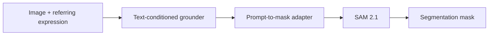
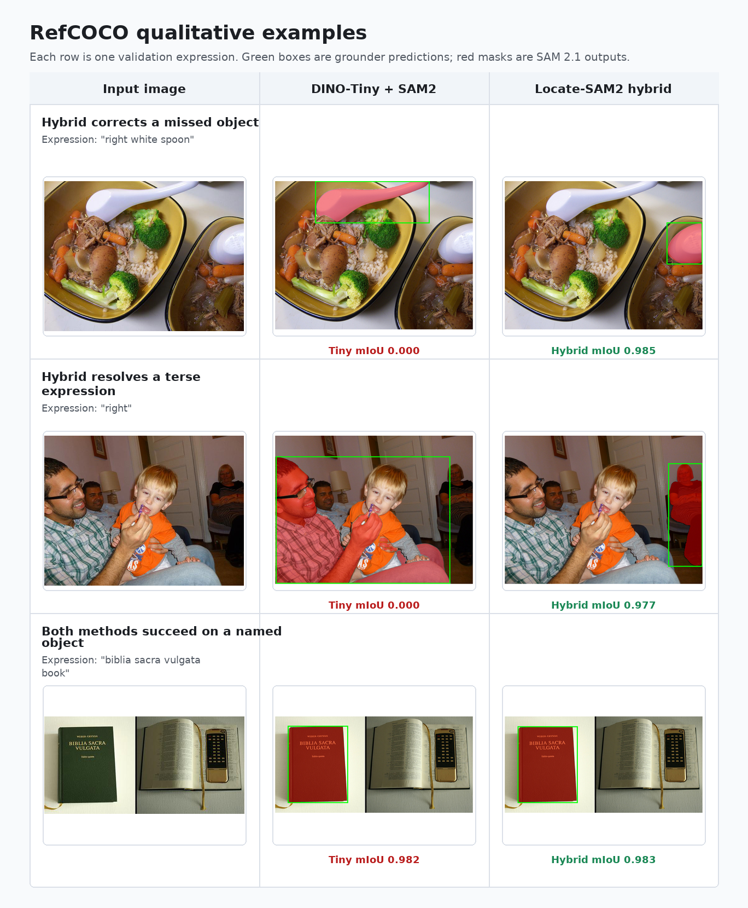
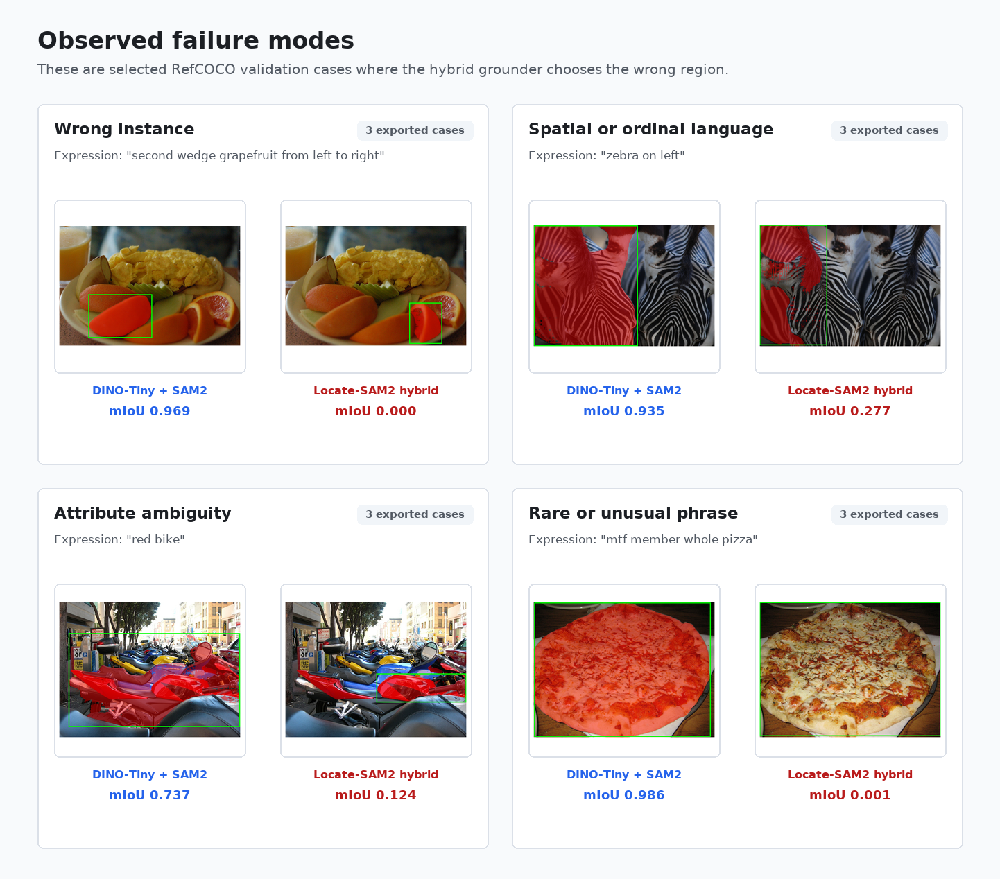
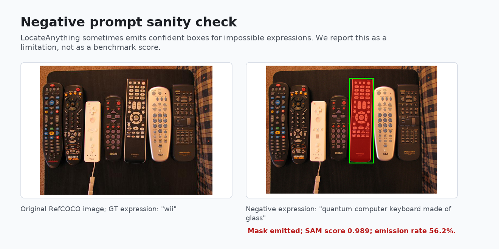

# Locate-SAM2

Training-free referring expression segmentation with [NVIDIA LocateAnything-3B](https://huggingface.co/nvidia/LocateAnything-3B) as the language-conditioned grounder and [SAM 2.1](https://huggingface.co/facebook/sam2.1-hiera-large) as the mask generator.

Locate-SAM2 follows the same modular idea used by Grounded-SAM style systems: text expression to box, box to SAM prompt, prompt to segmentation mask. The contribution in this repository is the integration and evaluation of LocateAnything as the grounder inside a SAM2 segmentation pipeline, with controlled comparisons against Grounding DINO plus the same SAM2 adapter.

Paper source and manuscript figures: [`research_paper/`](research_paper/). Published benchmark summaries: [`benchmarks/`](benchmarks/).

## What This Repository Shows

The main empirical finding is consistent across the RefCOCO family: under the same SAM 2.1 prompt adapter, Locate-SAM2 hybrid improves over Grounding DINO-Base + SAM2 on RefCOCO, RefCOCO+, and RefCOCO-g validation splits, and on RefCOCO and RefCOCO+ testA/testB splits.

This is a modular zero-shot pipeline comparison. It is not a leaderboard claim against supervised referring expression segmentation methods trained on mask annotations.

## Method

Given an image and a referring expression, the pipeline:

1. sends the expression and image to a text-conditioned grounder,
2. converts the predicted box into SAM2 prompts,
3. optionally crops around the predicted region,
4. asks SAM 2.1 for masks,
5. selects the final mask from SAM candidates.



Grounders are compared under the same adapter and SAM 2.1 weights.

| Method | Grounder | Role |
|--------|----------|------|
| DINO-Tiny + SAM2 | Grounding DINO-Tiny | Lightweight reference |
| DINO-Base + SAM2 | Grounding DINO Swin-T | Primary baseline |
| Locate-SAM2 fast | LocateAnything-3B | Single-pass LocateAnything decoding |
| Locate-SAM2 hybrid | LocateAnything-3B | Best LocateAnything decoding setting |
| GT-box + SAM2 | Ground-truth box | Diagnostic upper bound |

## Qualitative Examples

The examples below are from RefCOCO validation. Green boxes are grounder predictions, red overlays are SAM 2.1 masks, and mIoU is computed against the RefCOCO ground-truth mask.

| Column | What it shows |
|--------|---------------|
| Input image | Original COCO image and referring expression |
| DINO-Tiny + SAM2 | Lightweight visual baseline exported with per-case overlays |
| Locate-SAM2 hybrid | LocateAnything-3B hybrid grounding with the same SAM2 adapter |

DINO-Base is the primary quantitative baseline in the result tables below. The qualitative panel uses DINO-Tiny because those per-case overlays were exported with the manuscript figures.

Exported qualitative coverage:

| Export group | Count | Location |
|--------------|------:|----------|
| Fixed manuscript cases | 4 | [`research_paper/figures/`](research_paper/figures/) |
| Failure taxonomy | 12 | [`research_paper/figures/fail_*`](research_paper/figures/) |
| Hallucination probe cases | 33 | [`research_paper/figures/hallucination_probe/`](research_paper/figures/hallucination_probe/) |
| README composites | 3 | [`docs/assets/`](docs/assets/) |

<p align="center">
  
</p>

The first panel illustrates cases where the LocateAnything grounder recovers objects missed by DINO-Tiny under the same SAM2 adapter. The second panel shows selected failure modes: wrong-instance selection, spatial or ordinal language, attribute ambiguity, and unusual expressions.

<p align="center">
  
</p>

We also include a small negative-prompt sanity check. This is not a benchmark score. It documents a practical limitation: LocateAnything does not expose the same kind of native detection confidence threshold as DINO, so impossible prompts may still produce a confident-looking box and mask.

<p align="center">
  
</p>

More exported panels and case metadata are available in [`research_paper/figures/`](research_paper/figures/).

## Installation

Requires Python 3.10+, CUDA, and roughly 10 GB for model weights.

```bash
git clone https://github.com/jrootn/locate-sam2.git
cd locate-sam2
python -m venv .venv
source .venv/bin/activate
pip install -e .
pip install torch torchvision --index-url https://download.pytorch.org/whl/cu128

bash scripts/download_models.sh       # LocateAnything-3B + SAM 2.1
bash scripts/download_baseline.sh     # Grounding DINO-Tiny, optional
bash scripts/download_data.sh         # RefCOCO annotations + val images
bash scripts/download_train2014.sh    # train2014 images for RefCOCO-family eval
```

Python inference:

```python
from locate_sam2 import segment

masks = segment("image.jpg", "red car on the left")
```

CLI inference:

```bash
locate-sam2 segment image.jpg "person holding umbrella" -o out.png
```

Adapter defaults live in [`configs/default.yaml`](configs/default.yaml).

## Reproducing Benchmarks

Full benchmark runs:

```bash
bash scripts/run_full_eval_suite.sh      # RefCOCO val
bash scripts/run_missing_experiments.sh  # RefCOCO+ and RefCOCO-g val
bash scripts/run_test_splits.sh          # RefCOCO and RefCOCO+ testA/testB
```

Development runs:

```bash
python scripts/run_benchmark.py --subset-size 200 --seed 42
python scripts/run_ablation.py --subset-size 200
python scripts/validate_eval.py --subset-size 200 --seed 42
```

Local outputs are written under `outputs/`. Summary JSON files checked into the repository are under [`benchmarks/`](benchmarks/).

## Results

Metrics are mean mask IoU and precision at IoU 0.5. Validation numbers use RefCOCO, RefCOCO+, and RefCOCO-g val. Test numbers use RefCOCO and RefCOCO+ testA/testB. Latency and memory were measured on one NVIDIA RTX PRO 6000 Blackwell GPU.

### Validation Splits

| Dataset | n | DINO-Tiny mIoU | DINO-Base mIoU | Locate-SAM2 hybrid mIoU | GT-box oracle mIoU |
|---------|--:|---------------:|---------------:|------------------------:|-------------------:|
| RefCOCO val | 3,811 | 0.441 | 0.717 | **0.772** | 0.836 |
| RefCOCO+ val | 3,805 | 0.440 | 0.612 | **0.717** | 0.836 |
| RefCOCO-g val | 5,000 | 0.503 | 0.666 | **0.746** | 0.815 |

### Test Splits

| Dataset | Split | n | DINO-Base mIoU | Locate-SAM2 hybrid mIoU | DINO-Base P@0.5 | Locate-SAM2 hybrid P@0.5 |
|---------|-------|--:|---------------:|------------------------:|----------------:|-------------------------:|
| RefCOCO | testA | 1,975 | 0.761 | **0.807** | 87.4% | **93.1%** |
| RefCOCO | testB | 1,810 | 0.661 | **0.730** | 73.5% | **81.5%** |
| RefCOCO+ | testA | 1,975 | 0.708 | **0.766** | 81.3% | **88.2%** |
| RefCOCO+ | testB | 1,798 | 0.517 | **0.650** | 56.8% | **72.4%** |

### RefCOCO Val Detail

| Method | mIoU | P@0.5 | Peak VRAM |
|--------|-----:|------:|----------:|
| Grounding DINO-Tiny + SAM2 | 0.441 | 48.6% | 2.9 GB |
| Grounding DINO-Base + SAM2 | 0.717 | 81.7% | 3.1 GB |
| Locate-SAM2 fast | 0.769 | 87.5% | 8.9 GB |
| Locate-SAM2 hybrid | **0.772** | **88.1%** | 8.9 GB |
| GT-box + SAM2 oracle | 0.836 | 95.2% | 1.3 GB |

On RefCOCO val, hybrid reaches 92.3% of the GT-box oracle mIoU. The remaining gap is a useful diagnostic: much of the remaining error comes from grounding, while SAM2 performs strongly when given the correct box.

Full machine-readable tables are in [`benchmarks/`](benchmarks/), including `benchmarks/refcoco_val_table.json`, `benchmarks/refcoco_plus_table.json`, `benchmarks/refcocog_table.json`, and `benchmarks/test_splits/`.

## Scope and Limitations

Locate-SAM2 should be read as a training-free modular segmentation system, not as a supervised RES model. The comparisons here control SAM2 and the adapter while changing the grounder. The paper does not claim superiority over methods such as LAVT or CRIS that train directly for referring expression segmentation.

Known limitations:

| Limitation | Evidence in this repo |
|------------|-----------------------|
| Wrong object instance selection | RefCOCO failure taxonomy |
| Spatial and ordinal expressions remain difficult | RefCOCO failure taxonomy |
| Impossible prompts may still produce boxes | Negative-prompt sanity check |
| OOD generalization is not scored | OOD protocol exists, but no final image set is included |

## Repository Layout

```text
locate_sam2/          Python package: grounder, adapter, SAM2, evaluation
scripts/              Download helpers, benchmark drivers, figure builders
configs/              Default pipeline settings
benchmarks/           Published summary metrics
research_paper/       LaTeX manuscript and paper figures
experiments/          Notes and OOD protocol templates
docs/assets/          README figures
```

Not versioned: `models/`, `data/`, `outputs/`, and virtual environments. Per-reference evaluation logs remain local after full runs.

## License

| Component | License |
|-----------|---------|
| This repository | MIT |
| LocateAnything-3B | [NVIDIA license](https://huggingface.co/nvidia/LocateAnything-3B), non-commercial academic use |
| SAM 2.1 | Apache 2.0 |
| Grounding DINO | Apache 2.0 |

## References

- Wang et al., [LocateAnything](https://arxiv.org/abs/2605.27365), 2026.
- Ravi et al., [SAM 2](https://arxiv.org/abs/2408.00714), 2024.
- Liu et al., [Grounding DINO](https://arxiv.org/abs/2303.05499), 2023.
- Ren et al., [Grounded SAM](https://arxiv.org/abs/2401.14159), 2024.
